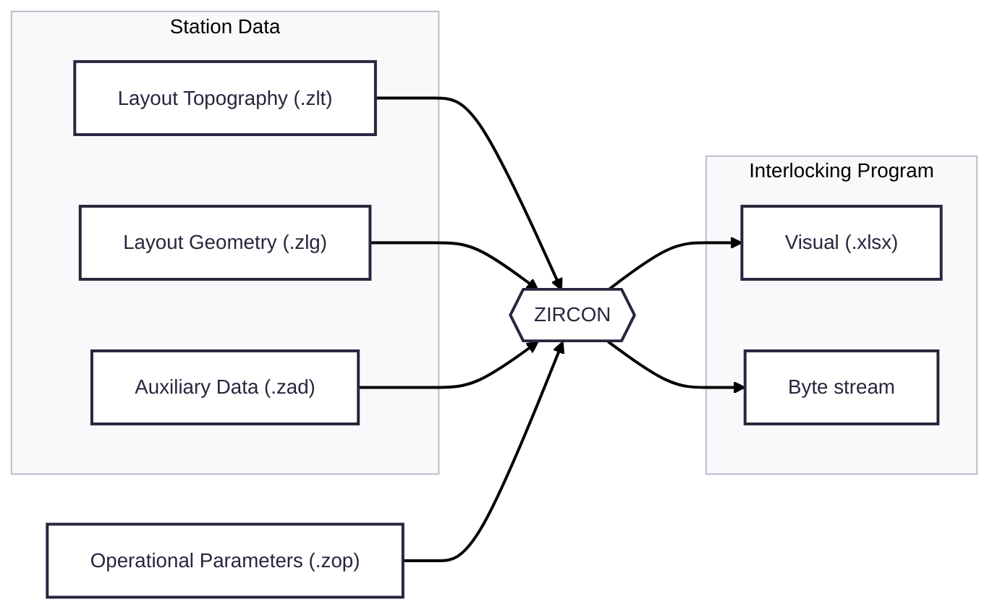
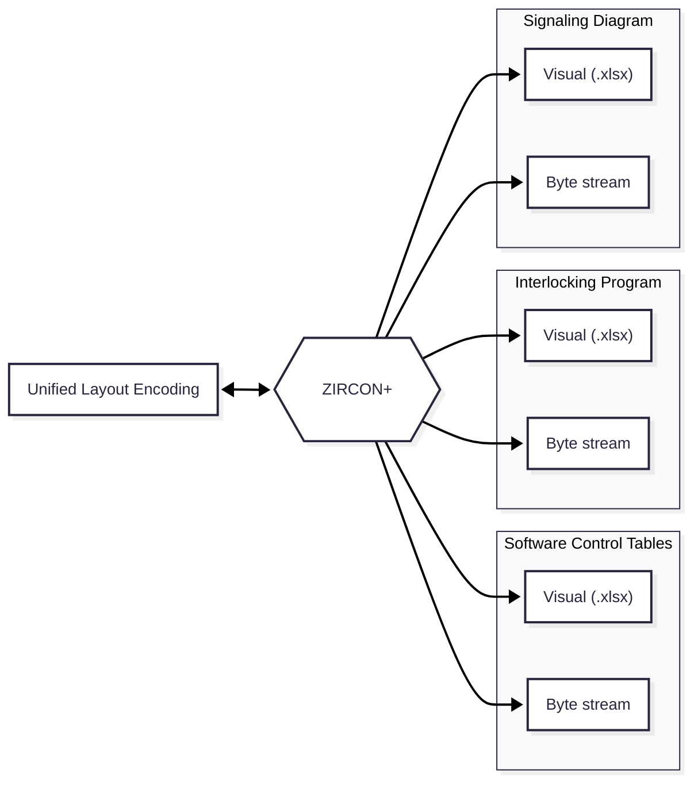

# ZIRCON

## Description
An interlocking engine for use in the design and testing phases of railway signaling projects. It automatically derives possible train movements, interlocking requirements, and delay timings from signaling diagram data. By enabling rapid iterations, ZIRCON accelerates project delivery, enhances optimization, and improves safety.

## Usage Guidelines

1. Encode a station (through ZIRCON parameterization files (**.zlt**, **.zlg** and **.zad**))
2. Place the station's parameterization files in the directory "ZIRCON/stations/input"
3. If necessary, create a new ZIRCON operational parameters file (**.zop**)
4. Ensure the **.zop** file to use is in directory ""ZIRCON/parameters"
5. Launch the program (ZIRCON/ZIRCON.py)
6. Interact with the program via the Command Line Interface (CLI). Type "**help**" to get a list of possible commands and their descriptions
7. Outputs will be generated in directory "ZIRCON/stations/output"

## CLI Commands

* **load**: Load a station's layout into memory and perform low level pre-processing. Layout parameterization files will be read. The **load** command takes argument [STATION_LABEL], which is the filename of each of the station's layout parameterization files (same for all files of the same station). The **process** command takes argument [ZOP_FILE_NAME], which shall correspond to the filename of the desired **.zop** file
* **process**: Process the loaded layout according to a specified set o operational parameters
* **export**: Perform basig post-processing and export the output to a file. The **process** command takes argument [FORMAT], which must be "**xlsx**" (for visual interpretation) or "**pickle**" (for downstream processing)
* **exit**: Stop execution
* **version**: Print the ZIRCON software version
* **help**: Print a list of possible commands and their descriptions

## ZIRCON Layout Topography File (.zlt)

### General rules
1. The filename must have no white spaces. It should be the stations abbreviation, for ease of use. The filename must be equal to the filename of the corresponding **.zlg** and **.zag** files
2. All caps
3. Every line starts with a keyword (**BLK**, **NDZ**, **SEC**, **NDE**, **PNT**, **SIG**, **SWP**)
4. No trailing or leading spaces
5. No empty lines, except for last line
6. Tabs should used before keywords to denote dependency between encoded elements
7. Keyword arguments are separated by whitespaces
   
### Encoding a block
1. Write keyword **BLK**
2. Write the block's label after the keyword (three letters or three letters followed by one number character). If the number in the label is odd, it is assumed that the block has an ascending normal direction, and vice versa. 
3. If the block has an associated signal, encode it on the next line using the signal specific keywords (**SIG** or **SWP**)

### Encoding an area without train detection (singularly connected to the area with train detection)
1. Write keyword **NDZ**
2. Write the label of the no-detection-zone after the keyword
3. If the no detection zone has an associated signal, encode it on the next line using the signal specific keywords (**SIG** or **SWP**)

### Encoding a section
1. Write keyword **SEC**
2. Write the section's label after the keyword
3. If the section contains a double-junction-switch, write **TJD** after the section's label
4. If the section does not possess train detection (area without train detection not singularly connected to the area with train detection), write **NDZ** after the section's label or after **TJD**

### Encoding a node
1. Write keyword **NDE**
2. Write the node's index after the keyword
3. If there is an element connected to the node, write the label of that element after the node's index
4. If the section containing the encoded node contains a single-junction-switch, and the node can not be crossed by transits that also cross section branches with associated switches, write **-** after the label of the connected element
* Note 1: A node is always associated with a section. The association is made with the section encoded immediatly before the node
* Note 2: The index of a node is an uppercase letter found by negativelly rotating an imaginary axis over the section containing the relevant node. The first node to be intersectid by the imaginary axis has index "A", and the next intercepted nodes are assigned the following alphabet's letters
  
### Encoding a signal
1. Write keyword **SIG** if the signal has no associated pedal, otherwise write keyword **SWP**
2. Write the signal's label after the keyword. If the signal is for circulation movements, the label should contain "S". If the signal is for shunt movements, the label should contain "M". If the signal is for circulation and shunt movements, the label should contain "S" and "M". If the signal is a shunting-limit-indicator, the signal label should be "M". If the signal is intended to be used with reverse movements, its label should contain "SC"
3. If the signal is for circulation movements but it can not originate main movements (i.e. the signal only has red and white beams), write __*__ after the signal's label
* Note 1: A signal is always associated with a node, a block, or a no-detection-zone. The association is made with the node, block, no-detection-zone encoded immediatly before the signal
* Note 2: A signal is associated with the element on to which it filters an incoming movement, even if it phisically lies on another element. The node with which the signal is associated is the node that would first be crossed by the incoming movement filtered by the signal. If the signal is associated with a block or singularly connected no-detection-zone, it is not associated with a node since these elements do not possess explicit nodes (they only have one connection, hence one node, hence the signal is associated with the connection of that element with the area with train detection)
* Note 3: In cases where a signal filters movements through more than one node of a section, or even different sections (i.e. signals with origin/destination indicator), associate the signal with each of the relevant nodes. Do not change the signal's label. State the same label as many times as necessary. Proper treatment will automatically be given to that signal.

### Encoding a switch or derailer
1. Write keyword **SWI**
2. Write the switch's label after the keyword. If the switch is a derailer, the label must contain "C"
* Note 1: A switch is always associated with a node. The association is made with the node encoded immediatly before the switch
* Note 2: If a transit through a section's node requires a switch on that section to be set in the reverse position, then that switch is associated with that node

## ZIRCON Layout Geometry File (.zlg)

### General rules
1. The filename must have no white spaces. It should be the stations abbreviation, for ease of use. The filename must be equal to the filename of the corresponding **.zlt** and **.zag** files
2. All caps
3. No trailing or leading spaces
4. No empty lines, except for last line
5. Tabs should used before data points to denote dependency between encoded elements
6. Data point arguments are separated by whitespaces
7. The distance unit used in the **.zop** file must be used in the **.zlg** file

### Encoding a section
1. Write the section's label
2. After the section's label, write the PKs of each of the section's nodes, sepparated by white-spaces. Start with the PK of the node with index "A", and follow alphabetic order
* Note: Sections are encoded on sepparate paragraphs, but all of them are preceded by a **SECS** keyword

### Encoding a switch or derailer
1. Write the switch's label
2. Write the PK of the switch or derailer's point after the switch or derailer's label
3. If the switch is not a derailer, write the switch's LR PK after the switch's point PK
* Note: Switches are encoded on sepparate paragraphs, but all of them are preceded by a **SWIS** keyword

### Encoding a signal
1. Write the signal's label. If the signal is a shunting-limit-indicator, it's label must be "M_section", where "section" is the label of the section with which the shunting-limit-indicator is associated
2. Write the PK of the signal's pole after the signal's label
3. If the signal is included in an aspect sequence and movements originating from the signal have a zone-of-approximation, write the PK of the zone-of-approximation's origin signal pole after the encoded signal's pole PK
4. If the signal is included in an aspect sequence and movements originating from the signal have a zone-of-approximation, write the zone-of-approximation's safety factor (distance)
* Note: Signals are encoded on sepparate paragraphs, but all of them are preceded by a **SIGS** keyword

## ZIRCON Auxiliary Data File (.zad)

### General rules
1. The filename must have no white spaces. It should be the stations abbreviation, for ease of use. The filename must be equal to the filename of the corresponding **.zlt** and **.zlg** files
2. No trailing or leading spaces
3. No empty lines, except for last line
4. Keyword arguments are separated by whitespaces
5. Keywords must not be added, deleted or modified

### Keyword description and arguments
* **station_name**: Name of the encoded station
* **station_lbl**: Label of the encoded station
* **interlocking_name**: Name of the interlocking where the encoded station lies
* **encoding_author**: Name of the author of the station's encoding files
* **date**: Date of the station's encoding

## ZIRCON Operational Parameters File (.zop)

### General rules
1. The filename must have no white spaces
2. No trailing or leading spaces
3. No empty lines, except for last line
4. Keyword arguments are separated by whitespaces
5. Keywords must not be added, deleted or modified
6. Any distance unit can be used, but it must be globally used

### Keyword description and arguments
* **regimes_to_block**: Movement regimes that are allowed to have a block as destination. Arguments can be: **Main**, **DOS** or **Shunt**
* **regimes_to_NDZ**: Movement regimes that are allowed to have a singularly connected no-detection-zone as destination. Arguments can be: **Main**, **DOS** or **Shunt**
* **regimes_to_terminal**: Movement regimes that are allowed to have a terminal section (section with disconnected node) as destination. Arguments can be: **Main**, **DOS** or **Shunt**
* **allow_shunt_to_circ_sig**: If shunt movements with circulation signals as destinations are possible. Arguments can be **True** or **False**
* **terminal_branches_are_destinations**: If a disconnected section's branch is a valid destination for movements. Arguments can be **True** or **False**. Relevant only if there are possible movement regimes with terminal sections as destinations
* **overlap_to_terminal_branch**: If movements can have alternative overlaps that cross a section's terminal branch. Arguments can be **True** or **False**
* **main_ol_distance**: Overlap distance of main movements
* **dos_ol_distance**: Overlap distance of DOS movements
* **shunt_ol_distance**: Overlap distance of shunt movements
* **horse_neck_possible**: If movements containing "horse neck" transit sequences are allowed (i.e. four or more consecutivelly crossed sections that have switches set in the reverse position, and where the first and last sections of this sequence are connected). Arguments can be **True** and **False**
* **logic_ol_possible_regimes**: Movement regimes that are allowed to have logic overlap. Arguments can be: **Main**, **DOS** or **Shunt**
* **logic_ol_switch_point_dependent**: If logic overlap possibility should be assessed based on the distance between the destination signal and the overlap switch's point PK, instead of the mere existance of tip oriented switches in an overlap section. Arguments can be **True** and **False**
* **allow_distant_switch_OL_lock**: If switches in overlap sections that have the point PK's distance to the movement's destination signal greater than the overlap distance should be locked. Arguments can be **True** and **False**
* **derailer_alt_OL_allowed_types**: Movement regimes for which an alternative overlap which locks a derailer in an overlap section in the normal position can exist. Arguments can be: **Main**, **DOS** and **Shunt**
* **derailer_margin**: Maximum distance on an overlap section before a derailer, so that an alternative overlap with the derailer locked in the normal position will have that section excluded from the overlap due to derailer filtering
* **shunt_sig_filters_fp**: If a shunt signal can can filter movements for flank protection purposes. Arguments can be **True** or **False**
* **OL_delay_dist_weight**: Weight of the computed distance for calculation of overlap delay timings
* **OL_delay_dist_bias**: Bias value added during computation of overlap delay timings
* **ARC_delay_dist_weight**: Weight of the computed distance for calculation of Approach Route Cancellation delay timings
* **ERC_delay_circ_multiplier**: Multiplier value used during computation of Emergency Route Cancellation delay timings of circulation movements
* **ERC_delay_shunt_multiplier**: Multiplier value used during computation of Emergency Route Cancellation delay timings of shunt movements
* **RC_min_delay**: Minimum value for Route Cancellation (ARC and ERC) delay timings
* **delay_round_multiple**: Maximum value for Route Cancellation (ARC and ERC) delay timings
* **delay_round_multiple**: Delay timings will be rounded to a multiple of this value
* **delay_round_down_allowed**: If delay timing values can be rounded down. Arguments can be **True** or **False**

## Next Steps in Development

This is a non-exhaustive exploration of possible improvements to the overal system. All this new functionality relies on the already developed interlocking engine, greatly simplifying further efforts. The estimated complexity of these new developments is estimated in a scale of 1 to 3, with 1 representing the lowest level of complexity.

### Upstream
1. **Layout Encoding Assistant** (complexity: 2)
2. **Unified Layout Encoding File** (complexity: 1)
3. **Signaling Diagram Generator** (complexity: 3)

## Midstream
1. **Incompatible Movement Engine** (complexity: 2)
2. **Inspection Assistant** (complexity: 1)
3. **Visual assistant** (complexity: 3)

## Downstream
1. **Software Control Table Generator** (complexity: 1)

