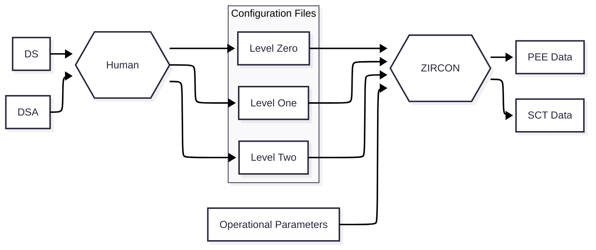

# ZIRCON

## Background
ZIRCON is software capable of assisting in the validation of railway signaling project documentation.
Although intended to be flexible, ZIRCON was concieved to work in the context of the Portuguese railway infrastructure, adhering to the stipulations of IP (Infraestruturas de Portugal) in terms of operation and design principles, as well as project documents.

The target for optimization is the validation of PEE (Programa de Encravamento e Exploração) and SCT (Software Control Table) data.
ZIRCON receives a encoded form of the infrastructure layout as well as operational parameters. From these, PEE and SCT data is generated, against which these documents can be validated.

## Configuration Files
In railway projects, information concerning the layout of infrastructure and signal aspect sequences is usualy held in drawings, which although ideal for manual workflows, hinders automation. Higher level documentation, such as PEEs and SCTs follow more structured, text based formats.
For the sake of reliability and simplicity, the input information for ZIRCON must follow a very structured form, exempt of ambiguity, redundancy and irrelevant information.
The ZIRCON configuration files are human and machine readable, text based encodings of a portion of railway infrastructure.
Although apparently trivial, these constitute the most critical part of ZIRCON, majorly affecting functionality and reliability.

### Level Zero
The level zero configuration file encodes layout topography, but excludes dimensions. It is a text file with extension ".ZcfgL0". The file name is free, but it is sugested that it is a three letter code for the station.
The encoding of L0 data from the DS to the file adheres to the following rules:

**General rules:**
1. All caps
2. Every line starts with a standard key (BLK, NDZ, SEC, NDE, PNT, SIG)
3. Keys follow hierarchy (BLK and SEC and NDZ are independant, NDE and PNT depend
    on SEC, SIG depends on NDE)
4. No trailing or leading spaces
5. No empty paragraphs, except for empty line at end
6. Tabs denote key hierarchy (no tabs before BLK, SEC and NDZ, one tab before
    NDE and PNT, two tabs before SIG)
7. Data points for each key are introduced after the key (same line),
    separated by white spaces
        
**Specific key rules:**

1. BLK
Encodes a block (group of sections between stations)
Syntax: BLK [block name]

2. NDZ
Encodes a no detection zone
Syntax: NDZ [no detection zone name]

3. SEC
Encodes a section (of a station)
Syntax: SEC [section name]
The section name must be 3 letters
Any NDE or PNT keys on paragraphs posterior to a certain SEC key will be subalternate to that SEC key

4. NDE
Encodes a node of a section (terminal point of the section). A section must always have two or more nodes
This key can only exist asociated with a SEC key
The syntax depends on weather the node represents a connection with another section, or with a block or a no detection zone, or in case there is no connection
Case connection w/ another section: NDE [index] [connected section name] [connected section relevant node index]
Case connection w/ a block or no detection zone: NDE [index] [connected block or no detection zone name]
Case no connection: NDE [index]
The node index follows the usual ABCD... nomenclature (clockwise rotation). However, the letter is followed (no whitespace) by a + or - sign.
This denotes weather the section, block or no detection zone connected with the corresponding node is at a higher or lower PK. + for higher, - for lower. The + and - signs can be ommited for the first and final nodes, for which + and - signs will be assumed, respectivelly. [connected section relevant node index] never requires a sign. In case of a terminal section (one node is not connected), the sign attributed to that node shall be the one relevent if another section where to be connected by said node, attending to the layout's topography

5. SWI
Encodes a switch
This key can only exist asociated with a SEC key
Syntax: SWI [switch name] [specific transit 1] [specific transit 2] [...] [specific transit n]
A specific transit of a switch is a transit possible only if that switch is set in the reverse (-) position.
Only one direction of a specific transit must be stated. e.g. AB obviates stating BA
A derailer is encoded as a switch.

6. SIG
Encodes a signal on a certain section
This key can only exist asociated with a NDE key
Syntax: SIG [signal name]
A signal is not necessairly dependent on the section where it phisically lies, but instead it is associated with the section for which it filters movements. The corresponding node is the node first intersected by the movements the signal filters

### Level One
The level one configuration file encodes layout geometry. It is a text file with extension ".ZcfgL1". The file name is free, but it is sugested that it is a three letter code for the station.
The encoding of L1 data from the DS to the file adheres to the following rules:

**General rules:**
1. All caps
2. No trailing or leading spaces
3. No empty paragraphs, except for empty line at end
4. Data points for each key are introduced after the key (next paragraphs until next key is reached)
        
**Specific key rules:**

1. SECS
PKs of the several section's nodes
Syntax: SECS
            [section_1_label] [pk_of_node_A] [pk_of_node_B] ... [pk_of_node_N]
            ...
            [section_n_label] [pk_of_node_A] [pk_of_node_B] ... [pk_of_node_N]
            
2. SWIS
Point pk and fouling point pk (if its not a derailer)
Syntax: SWIS
            [switch_1_label] [pk_point] [pk_fouling_point (if applicable)]
            ...
            [switch_n_label] [pk_point] [pk_fouling_point (if applicable)]

3. SIGS
Pk of signal poles
Syntax: SIGS
            [signal_1_label] [pk]
               ...
            [signal_n_label] [pk]
            

### Operational Parameters
This file contains a set of constants used for calculations. These are usually the same for most stations

The variable names in the file shall not be modified, only theys attributed values.
The variable names ocupy a paragraph each, with the corresponding value or values sepparated by white spaces

**Description of constants:**

1. MAIN_OL_DISTANCE
    Overlap distance for main itineraries.
    Value in meters.

2. DOS_OL_DISTANCE
    Overlap distance for drive on sight itineraries.
    Value in meters.
    
3. SHUNT_OL_DISTANCE
    Overlap distance for shunt itineraries.
    Value in meters.
    
4. HORSE_NECK_POSSIBLE
    If itineraries through two switches in the reverse position, both having they'r point at the same pk, are possible.
    TRUE or FALSE

5. TO_BLOCK
    Types of itineraries that can be routed to a block.
    [type_A] ... [type_N]
    (types are MAIN, DOS and SHUNT)
    (can be empty)
    
6. TO_NDZ
    Types of itineraries that can be routed to a no detection zone.
    [type_A] ... [type_N]
    (types are MAIN, DOS and SHUNT)
    (can be empty)
    
7. TO_TERMINAL
    Types of itineraries that can be routed to a terminal section (has one or more disconnected nodes).
    [type_A] ... [type_N]
    (types are MAIN, DOS and SHUNT)
    (can be empty)
    
8. TO_TERMINAL_SWITCH_BRANCH
    Types of itineraries that can be routed to a terminal section, where the section has more than two nodes.
    [type_A] ... [type_N]
    (types are MAIN, DOS and SHUNT)
    (can be empty)
    
