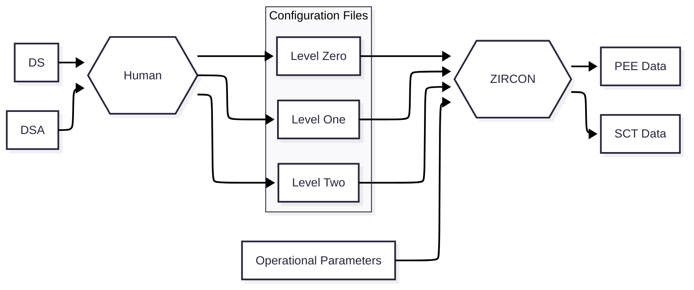

# ZIRCON

## Background
ZIRCON is software capable of assisting in the validation of railway signaling project documentation.
Although intended to be flexible, ZIRCON was concieved to work in the context of the Portuguese railway infrastructure, adhering to the stipulations of IP (Infraestruturas de Portugal) in terms of operation and design principles, as well as project documents.

The target for optimization is the validation of PEE (Programa de Encravamento e Exploração) and SCT (Software Control Table) data.
ZIRCON receives a encoded form of the infrastructure layout as well as operational parameters. From these, PEE and SCT data is generated, against which these documents can be validated.

